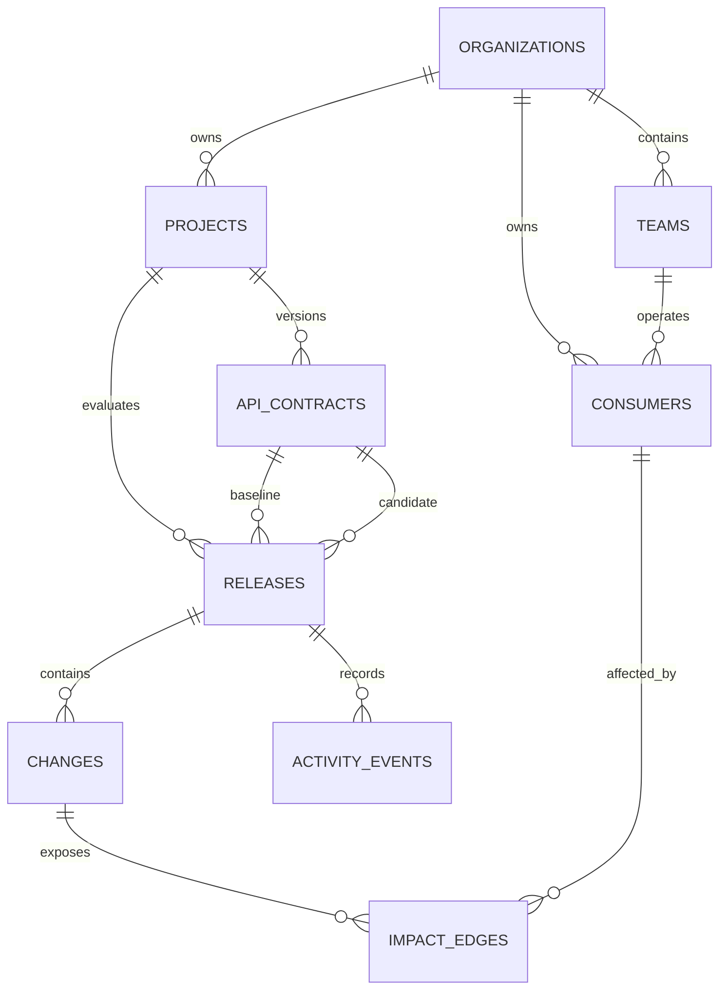

# CompatGraph architecture

CompatGraph is a modular full-stack application with a deliberately small deployment surface. The product is one Next.js service today, while contract analysis stays framework-independent so it can move into retry-safe workers when asynchronous ingestion lands.

## Runtime boundaries

```mermaid
flowchart LR
    Browser[Browser] -->|HTTPS| Next[Next.js application]
    Next -->|bounded preview request| Analyzer[Deterministic analyzer]
    Analyzer -->|stable findings| Next
    Next -->|server-only queries| Data[Data access layer]
    Data -->|pooled SQL| Postgres[(PostgreSQL)]
    Next -->|health probe| Health[/api/health]
    Health -->|SELECT 1| Postgres
    CI[GitHub Actions] -->|migrate and seed| Postgres
    CI -->|quality and browser gates| Next
```

Pages and layouts in `src/app` are React Server Components by default. They can read through `src/data`, but they do not issue HTTP requests back into their own route handlers. Interactive browser-only behavior will be isolated in small Client Components. `src/db/client.ts` lazily creates the PostgreSQL client so importing a page during build does not require a connection.

## Compatibility analysis

`src/analysis` is a framework-independent deterministic core. It parses JSON or YAML OpenAPI 3.0 and 3.1 documents, resolves local component-schema references, compares operations and JSON-shaped request and response schemas, and returns a stable ordered result. Rules currently cover operation and response additions or removals, request-body and property requirements, property additions or removals, scalar and array type changes, and direction-aware enum changes.

Every finding carries a content-derived identifier, severity, operation, JSON pointer, before and after evidence, and a human explanation. Identifiers exclude presentation copy so editing an explanation does not change finding identity. A request enum narrowing is breaking because existing callers may send a removed value; a response enum widening is dangerous because generated clients may not recognize the new value.

`POST /api/analyze/preview` is a non-persisting boundary for the upcoming upload workflow. It accepts baseline and candidate contract strings, limits each contract to 512 KiB, and returns structured 400, 413, or 422 errors for malformed requests, oversized inputs, or invalid contracts. The endpoint does not fetch references or call external services, keeping analysis reproducible and preventing untrusted contracts from triggering network access.

## Persistence model



The model keeps evidence normalized rather than storing one dashboard-shaped JSON document. A release points to immutable baseline and candidate contracts. Deterministic findings belong to that release. An impact edge is a many-to-many relationship between a finding and a consumer and records how the relationship was discovered. Team ownership remains independent of releases, allowing ownership changes without rewriting historical findings.

Database constraints protect stable slugs, contract versions and hashes, consumer names, impact-edge uniqueness, foreign-key integrity, and the 0–100 risk-score range. Indexes follow dashboard access patterns: latest release per project, findings per release and severity, consumer ownership, and chronological activity.

## Migration and recovery

`src/db/schema.ts` is the typed model used by application code. SQL under `drizzle/` is the deployment artifact. Migrations are additive and immutable once shared. The application must remain compatible with the prior schema during a deployment rollback window.

The synthetic demonstration seed uses stable identifiers and upserts. Running `pnpm db:seed` repeatedly updates the same rows and never creates duplicates. A failed web deployment can roll back to the previous immutable application build. Database rollback should use a forward corrective migration rather than editing or removing an applied migration.

## Planned evolution

The web application will next persist analyzer results transactionally. When repository ingestion and larger contracts require durable background work, the same boundary can run in a worker with an idempotency key derived from project, baseline hash, and candidate hash. That extraction is evidence-driven; no queue or service boundary is introduced before the workflow needs retries outside an HTTP request.
