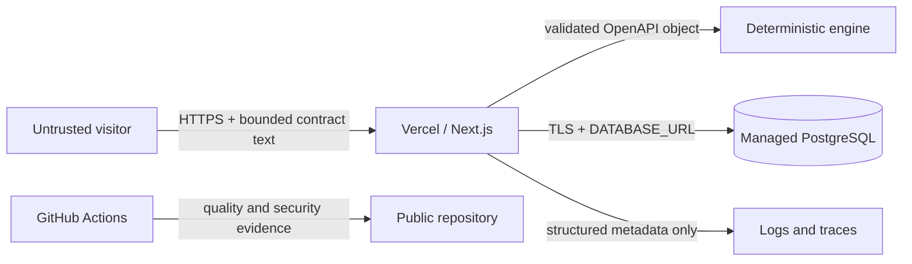

# CompatGraph threat model

## Scope and assets

This model covers the public Next.js application, its PostgreSQL database, contract-analysis endpoints, and the managed deployment boundary. The most important assets are submitted API contracts, release findings, consumer ownership data, database credentials, rate-limit privacy salt, deployment credentials, and the integrity of compatibility verdicts.

The current public demonstration is intentionally single-tenant and synthetic. It does not claim repository ownership or accept private GitHub credentials. Authentication and private-repository ingestion require a separate authorization milestone before real customer data is allowed.

## Trust boundaries

Contracts, request headers, route parameters, and database state are untrusted inputs. Hosting-provider headers are trusted only after the request reaches the managed platform. Repository content and pull requests never grant runtime authorization.

## Threats and controls

| Threat                              | Current control                                                                                                                       | Residual risk / next control                                                                                                   |
| ----------------------------------- | ------------------------------------------------------------------------------------------------------------------------------------- | ------------------------------------------------------------------------------------------------------------------------------ |
| Parser or memory exhaustion         | 512 KiB per-contract and aggregate request limits; bounded YAML alias expansion; no remote reference resolution                       | Deeply nested documents can still consume CPU; add measured depth limits if production traces show abuse                       |
| SSRF through `$ref`                 | Analyzer resolves only local `#/components/schemas/...` references                                                                    | External-reference ingestion remains explicitly unsupported                                                                    |
| Write amplification / database cost | Atomic PostgreSQL rate limit: 10 persisted analyses and 30 previews per client per hour                                               | Distributed attackers require provider WAF rules and account-level quotas                                                      |
| Client-address disclosure           | Client identifiers are salted and SHA-256 hashed before persistence; logs never include addresses or contracts                        | Rotate `RATE_LIMIT_SALT` during a privacy incident, accepting bucket invalidation                                              |
| Duplicate or replayed submissions   | Content-derived contract hashes and a unique analysis key make the transaction idempotent; concurrent inserts converge on one release | Engine-version changes deliberately produce a new analysis identity                                                            |
| SQL injection                       | Drizzle parameterizes queries and migrations are committed SQL artifacts                                                              | Raw SQL remains limited to static rate-limit expressions and migration statements                                              |
| Stored script injection             | React escapes displayed contract evidence; raw documents are never rendered as HTML                                                   | Future Markdown or rich diff rendering must sanitize output                                                                    |
| Clickjacking and browser injection  | CSP, `frame-ancestors 'none'`, `X-Frame-Options: DENY`, MIME sniffing protection, restrictive permissions policy                      | CSP currently permits inline scripts/styles for Next.js; tighten with nonces if the framework deployment supports them cleanly |
| Secret disclosure                   | Repository contains examples only; production secrets belong in provider environment storage; logs use an explicit metadata allowlist | Deployment access and secret rotation still depend on provider account security                                                |
| Dependency compromise               | Frozen lockfile, dependency review, CodeQL, Dependabot, and minimal runtime dependencies                                              | Maintainer review remains required before automated dependency merges                                                          |
| Cross-tenant access                 | Only synthetic public data is supported; no private tenant claims are made                                                            | Authentication, project authorization, and row-level tenant tests are mandatory before private data                            |

## Abuse and privacy decisions

The API does not log request bodies, contract text, raw client addresses, or database URLs. Correlation IDs and OpenTelemetry trace IDs are safe operational metadata. Rate-limit rows may be deleted after their window expires; they are not an analytics source.

The public demo fails closed if the privacy salt is missing in production or PostgreSQL is unavailable. Health responses reveal connectivity state and latency but no hostnames, credentials, schema names, or query text.

## Security verification

Each pull request runs the application quality suite, PostgreSQL integration and browser journeys, dependency review, and CodeQL. Production acceptance additionally checks security headers, rate-limit behavior, health, migration state, and the deployed revision. Findings that change this model require an update to this document in the same pull request.
